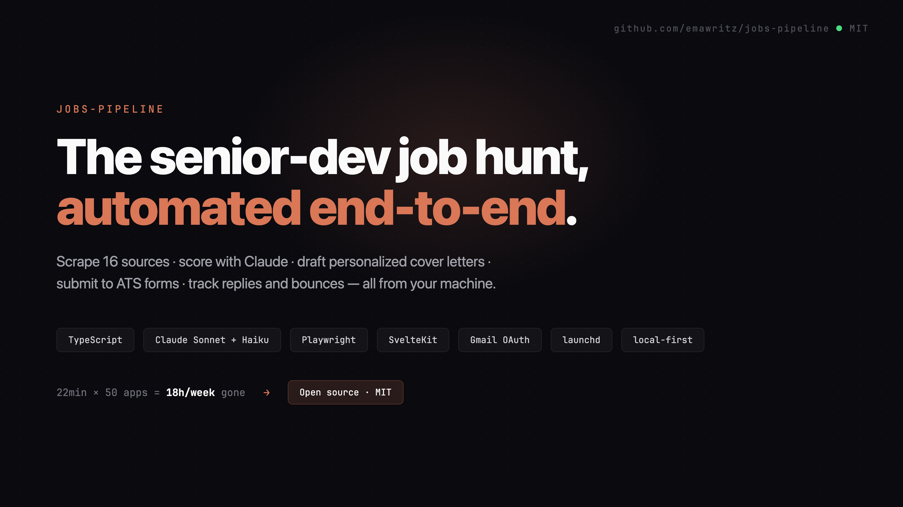
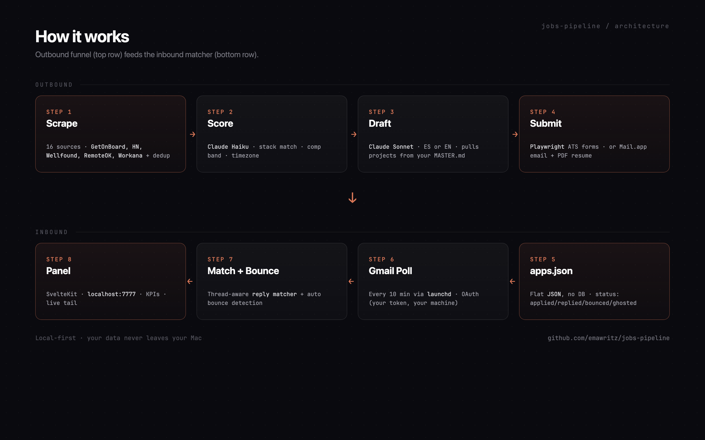
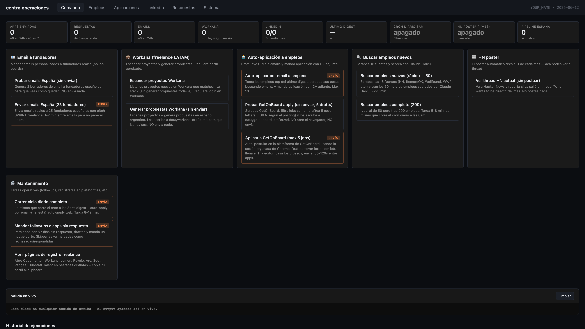
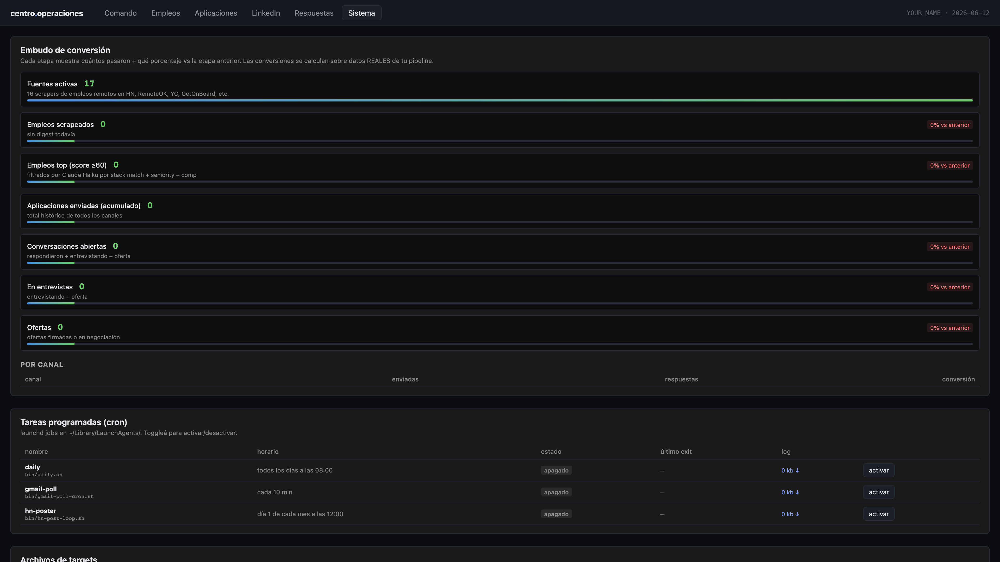
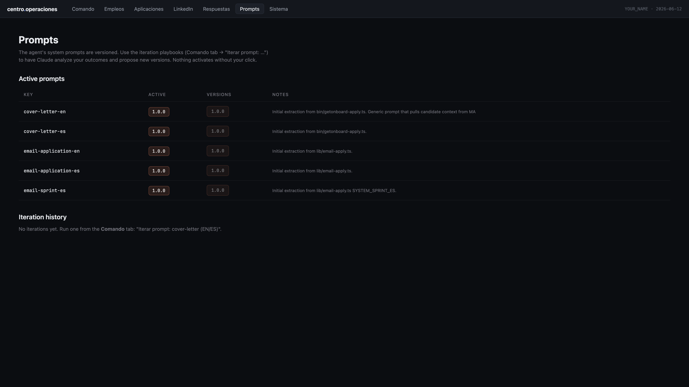

<div align="center">



# jobs-pipeline

**Local AI agent that runs your senior-dev job hunt end-to-end.**

Scrape 16 sources · score with Claude · draft personalized cover letters · submit to ATS forms · track replies and bounces — all from your machine.

[](LICENSE)
[](https://nodejs.org)
[](https://www.anthropic.com)
[](https://www.apple.com/macos)

</div>

---

## Why this exists

A senior remote application, done right, costs **~22 minutes**:

```
read JD (5m) → write cover letter (10m) → fill ATS form (5m) → log it (2m)
```

50 applications a week is **18 hours gone** before you write a single line of real code. If you've been hunting more than two weeks, you already know:

- Cover letters get copy-pasted
- Follow-ups get forgotten
- Two-thirds of your sends went to bounced inboxes
- You apply to the same role twice without realizing

This agent does the boring 80% so you spend your hours on the 20% that actually decides: prepping for the call, refining your pitch, writing the code that closes the contract.

## What it does



**End-to-end stages:**

1. **Scrape** 16 sources (GetOnBoard, HN Who's Hiring, Wellfound, RemoteOK, We Work Remotely, Workana, …)
2. **Score** each posting with Claude Haiku against your stack + comp band + timezone
3. **Draft** a cover letter with Claude Sonnet — Spanish or English depending on the posting, mapping your real projects to their stack
4. **Submit** to ATS forms via Playwright (Trix editor, radio groups, salary fields, multi-step wizards) — currently solid against GetOnBoard
5. **Email** the founder/recruiter via Mail.app with your PDF resume attached (uses Gmail, not raw SMTP)
6. **Track** every send in `data/applications.json` with status: `applied` / `replied` / `bounced` / `ghosted`
7. **Poll Gmail** every 10 min via launchd → match replies back to apps, auto-detect bounces, never send to a bad address twice
8. **Visualize** the funnel at `localhost:7777` (SvelteKit panel)

## Quick start

```bash
git clone https://github.com/YOUR_USERNAME/jobs-pipeline.git
cd jobs-pipeline

# Install
npm install
cd web && npm install && cd ..

# Configure (three files — that's it)
cp .env.example .env             # CLAUDE_BIN + your name/email
cp MASTER.example.md MASTER.md   # YOUR projects + metrics (this is the file)
cp data/answers.example.json data/answers.json

# Optional: Gmail OAuth for auto reply detection
npm run gmail-auth

# Run
npm run dev   # opens localhost:7777
```

First run: dry-mode against a single job, no submits, no emails:

```bash
npx tsx bin/getonboard-apply.ts --dry-run --max=1
# → drafts a cover letter and prints it. Nothing leaves your machine.
```

## The panel

`localhost:7777` — KPIs across the funnel (apps sent, replies, bounces, Workana, LinkedIn, HN, Spain pipeline), one-click playbooks, live tail of running jobs, cron status, and Gmail integration health.



The **Sistema** tab surfaces the conversion funnel (scraped → top-scored → applied → replied → in interview → offer) and lets you toggle cron schedules from the UI.



## Self-iterating prompts (v0.2)

The agent's system prompts are **versioned** in `lib/prompts/<key>.v<N>.ts`. Each generated cover letter persists to `data/cover-letters/<appId>.json` alongside the version that produced it.

When you have enough sample data (≥10 apps with outcomes), run an iteration:

```bash
npm run prompt-iterate -- --key=cover-letter-en --sample=30
```

The script:

1. Pulls your last N apps with their outcomes (`replied` / `bounced` / `ghosted`)
2. Pairs each with the cover letter that was drafted for it
3. Sends the bundle to Claude (via Code CLI — $0 marginal cost) with a critique prompt
4. Writes a markdown report to `data/prompt-iterations/<id>.md` with: findings, proposed diff, full new prompt
5. If Claude's verdict is `iterate`, writes a candidate `lib/prompts/<key>.v<N+1>.ts` — **not activated**

You review the report in the **Prompts** tab and click to activate. One click rolls back too.



### Hard guardrails (won't change without you)

- Versions are **append-only**. The script never overwrites an existing `.vN.ts`.
- New versions never auto-activate. The active version is pinned in `data/prompt-active.json`.
- Critique cannot weaken truthfulness rules, banned-phrase lists, or output format constraints.
- If sample is `< 10` outcomes, the script bails with `insufficient-data` and returns the prompt unchanged.

### Why this matters

Most "AI for X" tools quietly degrade because nobody measures whether the prompt is still good. Here every cover letter is recorded, every outcome is paired, and the iteration loop runs on real data — your reply rate, not "Claude thinks this sounds better".

## The MASTER.md file is the whole game

The agent does not invent claims. It pulls projects + metrics straight from your `MASTER.md` profile and lets Claude map them to each posting.

```md
# MASTER profile

## Hero projects (use these, in order, when matching to roles)

### 1. Your-Project — short positioning line
- **URL:** https://yourproject.com
- **Role:** founder / sole engineer / tech lead
- **Status:** 200 paying users, $4k MRR, 18 months in prod
- **Stack:** TypeScript + NestJS + Postgres + Stripe
- **Unique:** the one thing nobody else can claim

### 2. Your-Second-Project
...
```

That's the file every cover letter is built from. **If your MASTER is generic, every cover letter sounds generic.** If it has shipped artifacts with numbers, the cover letters reference them by name. There's no AI magic here — there's a structured profile and a good prompt.

See [`MASTER.example.md`](MASTER.example.md) for the full template.

## What's in the box

| Module | What it does |
|---|---|
| `bin/digest.ts` | Multi-source scraping → scoring → dedup → ranked digest |
| `bin/getonboard-apply.ts` | Full ATS submit flow against GetOnBoard (cover, salary, radios, preview, submit) |
| `bin/email-spain-sprint.ts` | Cold founder outreach with SPRINT-style pitch |
| `bin/gmail-poll.ts` | Reply detection + bounce tracking via Gmail OAuth |
| `bin/followup.ts` | Drafts nudge messages for apps with 7+ days silence |
| `lib/bounce-tracker.ts` | Persists bad addresses so you never send twice |
| `lib/reply-matcher.ts` | Matches incoming Gmail to outbound apps by thread and recipient |
| `lib/email-guesser.ts` | DNS MX-verified founder email guessing for companies without listed contacts |
| `web/` | Local SvelteKit panel — KPIs, playbooks, replies, live tail |

## Stack

- **Runtime** — Node 22+ with `tsx` (no build step for backend scripts)
- **Scraping** — Playwright (browser) + Cheerio (HTML parse)
- **AI** — Claude Sonnet (drafts) + Haiku (scoring) via [Claude Code CLI](https://claude.com/claude-code) — your existing subscription covers it, $0 in API spend
- **Email outbound** — Mail.app via AppleScript (Gmail relays, not raw SMTP — your IP stays clean)
- **Email inbound** — Gmail OAuth + thread-aware matcher
- **Schedules** — launchd plists (daily 8am sweep · 10-min Gmail poll · monthly HN poster)
- **Panel** — SvelteKit + Vite, local-only at `localhost:7777`
- **Persistence** — flat JSON in `data/` (no DB — easy to inspect, diff, restore)

## Why local-only

| Concern | Local | Hosted SaaS |
|---|---|---|
| Founder PII (the people you contact) | Stays on your Mac | Lives in someone else's DB |
| Cookies for GetOnBoard / Workana / LinkedIn | `.playwright-data/` on your disk | Shared infra surface |
| Gmail OAuth token | Your file system | Centralized blast radius |
| Customization (prompts, scoring, filters) | Edit any `.ts` | Wait for a feature flag |
| Cost at 1000 apps/month | $0 marginal (uses your Claude Code subscription) | $50+ subscription on top |

Hosting this for someone else is on the roadmap. For now: own your funnel, own your data.

## Status

- ✅ **GetOnBoard apply** — submits end-to-end (Trix editor, radio groups, salary, multi-step, preview/submit detection)
- ✅ **Email outreach** with bounce tracker + auto status updates
- ✅ **Gmail reply detection** + matching by thread + by recipient + bounce classification
- ✅ **Local panel** with live tail and KPIs
- ✅ **Self-iterating prompts (v0.2)** — every cover letter is persisted with its prompt version; one command runs a critique loop and proposes the next version
- 🚧 **Workana** — works behind login; sessions need manual refresh
- 🚧 **LinkedIn** — manual flow today, semi-auto next
- 📋 **Multi-tenant SaaS** — not yet (see "Why local-only" above)

## Roadmap

- [ ] 60-second demo video
- [ ] AbstractAPI / Hunter integration for pre-send email validation
- [ ] Followup automation (nudge apps with >7 days no reply)
- [ ] LinkedIn semi-auto outreach
- [ ] Pluggable scoring (replace heuristics with your own rubric)
- [ ] CI: smoke test for scrapers + dry-run apply

## Contributing

This is a tool the maintainer uses on their own job hunt, so PRs that fit that workflow get merged fast. PRs that turn it into a SaaS are out of scope — fork freely if that's your goal.

Useful PRs:

- New scrapers (`scrapers/*.ts`)
- New ATS form integrations (`bin/<platform>-apply.ts`)
- Better email-guesser patterns or validation backends
- Cover-letter prompt improvements (with examples showing why)

## License

MIT. See [LICENSE](LICENSE).

## Disclaimer

This is a tool that automates outreach you would otherwise do by hand. Use it with the same restraint you'd use yourself:

- Don't blast generic messages — the `MASTER.md` + per-job prompt design exists so each send is specific
- Don't scrape platforms that explicitly forbid it
- Respect bounce/unsubscribe signals — the bounce-tracker enforces this, don't disable it
- Mail.app via Gmail keeps your sender reputation clean; don't swap to raw SMTP from a residential IP

Cold email at scale damages your reputation when done lazily. This tool makes it **faster to do it well**, not **easier to do it badly**.

---

<div align="center">

**Built by a senior LATAM dev who got tired of copy-pasting cover letters.**

⭐ Star this if it saves you an hour.

</div>
